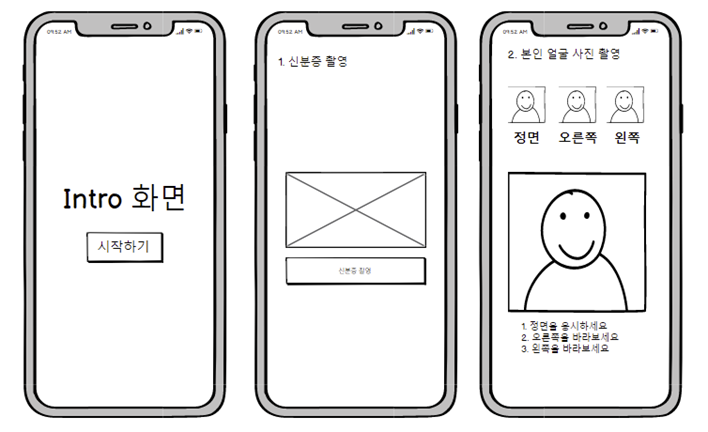
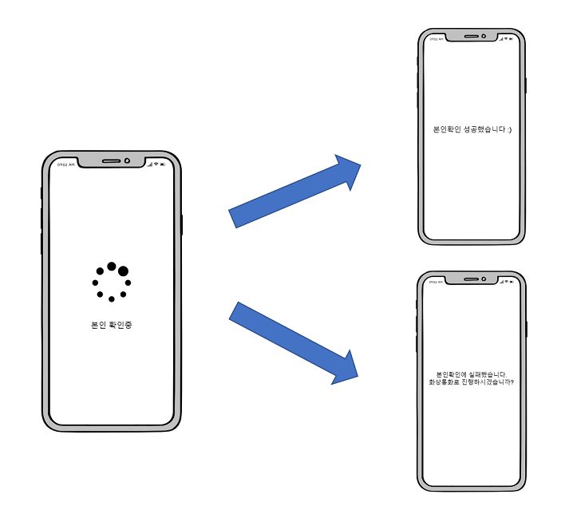
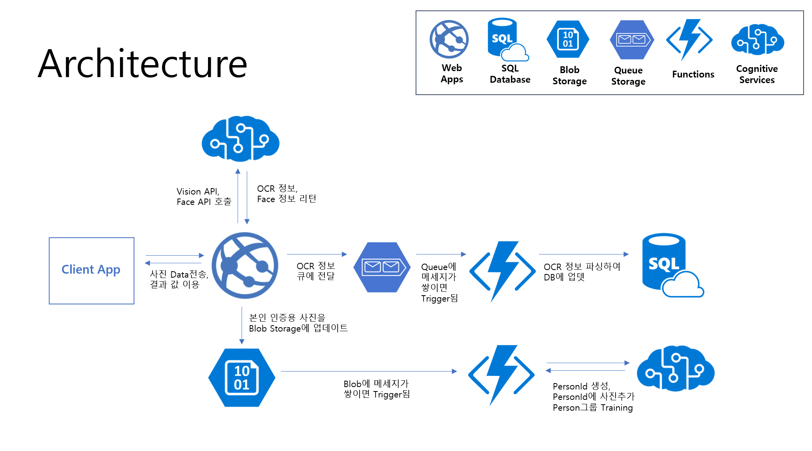
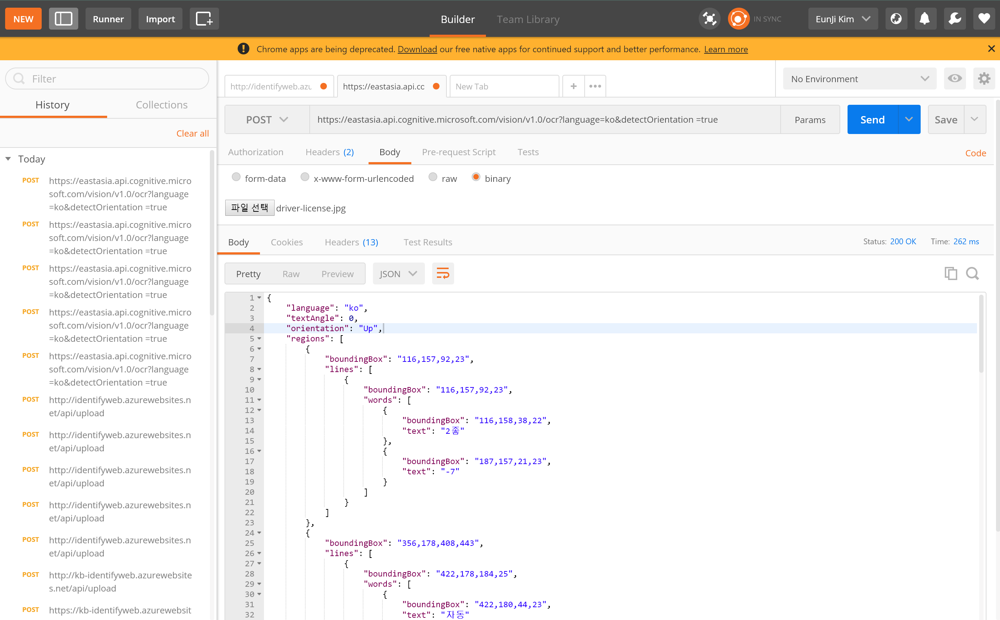
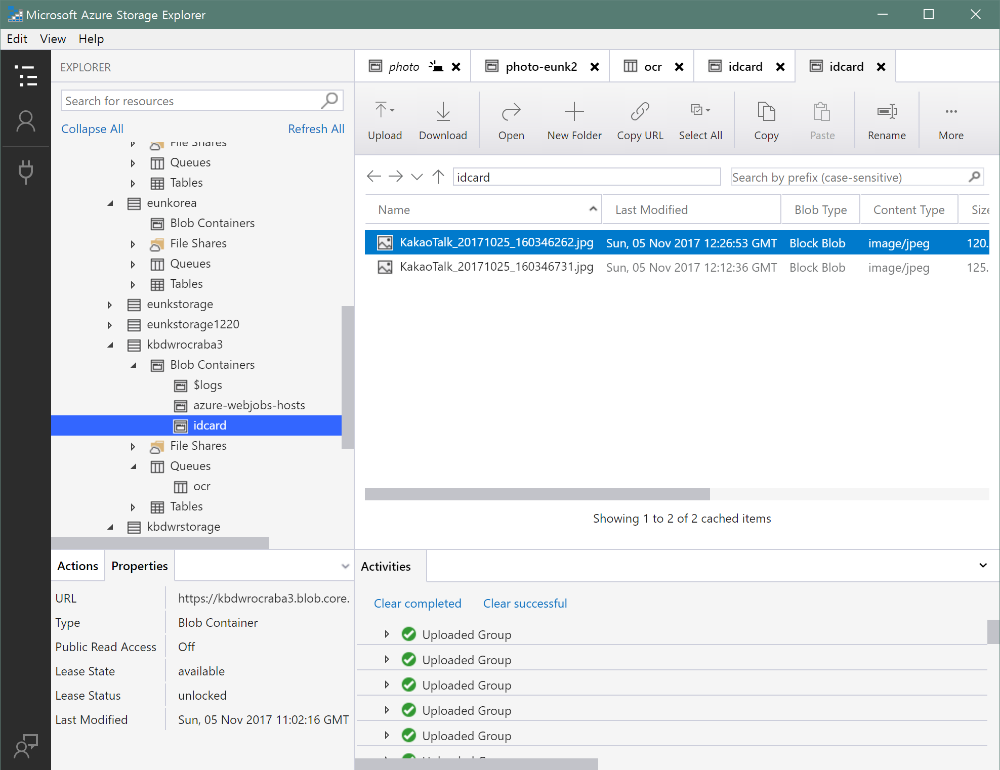

# Cogntive Service를 활용한 비대면 인증 시나리오 검토

Microsoft Cognitive Service는 마이크로소프트의 인공지능 기술을 개발자들이 쉽게 사용할 수 있도록 서비스화 해놓은 것 입니다. 간단히 API호출 만으로도 언어에 상관없이 편리하게 인지와 관련된 여러가지 서비스를 사용할 수 있습니다. 이번 프로젝트에서는 Cognitive Serivces 중에서도 Vision에 해당하는 서비스인 Computer Vision API와 Face API를 이용하여 신분증 만으로도 비대면 인증이 가능한지를 검토해 볼 예정입니다. 
Cognitive Serivces와 관련된 자세한 정보는 아래에서 참고하실 수 있습니다. 

* [Microsoft Cognitive Services](https://azure.microsoft.com/ko-kr/services/cognitive-services/)
* [Computer Vision API](https://azure.microsoft.com/ko-kr/services/cognitive-services/computer-vision/)
* [Face API](https://azure.microsoft.com/ko-kr/services/cognitive-services/face/)  

## 시나리오 

사용자는 본인인증용 애플리케이션을 실행하고 신분증 사진을 찍습니다. 그 다음 지시에 맞추어 고개를 돌려가며 자신의 모습을 찍습니다. 신분증 사진과 방금 찍은 사용자 사진을 기반으로 Cognitive Services를 이용하여 두 인물이 동일인이 맞는지 확인합니다. 부가적으로 OCR 기술을 활용하여 신분증상의 개인 정보를 인지하고 DB에 저장합니다. 




## Architecture



클라이언트 앱에서는 사진 촬영 및 전송에 해당하는 기본적인 기능만 수행하고, 나머지 주요한 로직은 전부 마이크로소프의 클라우드 서비스인 Azure에서 수행되게 됩니다. 추후 확장성과 설계의 유연함을 고려하여 Azure Functions이라는 이벤트 기반의 서비스를 이용하여 해당하는 요청이 발생될 때마다 특정 동작이 수행되도록 설계하였습니다. 

## Settings

본 프로젝트에서 이용할 프로그램들은 다음과 같습니다. 

1. Visual Studio 2017

Client Application으로는 윈도우 10 기기에서 동작하는 애플리케이션인 UWP App으로 개발할 예정입니다. 또한 Web API를 이용하여 간단하게 서버사이드 로직을 구현할 예정입니다. 이를 위해서는 컴퓨터에 [Visual Studio 2017을 설치](https://www.visualstudio.com/ko/)한 후에 Visual Studio Installer에서 다음의 옵션들을 선택하고 다운로드 받으시면 됩니다. 


2. Chrome 및 Postman 

개발자 도구 및 API 테스트를 편리하게 할 수 있는 아주 유용한 도구인 POSTMAN 사용을 위해 크롬을 설치한 후 -> POSTMAN을 설치하시기 바랍니다.  

* [Chrome 설치](https://support.google.com/chrome/answer/95346?co=GENIE.Platform%3DDesktop&hl=ko) 
* [POSTMAN 설치](https://chrome.google.com/webstore/detail/postman/fhbjgbiflinjbdggehcddcbncdddomop) 



3. Azure Storage Explorer

Azure Storage에 있는 파일 목록을 쉽게 확인하고 파일 추가 및 삭제 권한 관리등이 가능합니다. 

* [Azure Storage Explorer](https://azure.microsoft.com/en-us/features/storage-explorer/)



4. Git

소스코드 형상관리를 위해 Git을 사용할 예정입니다. 

* [Git 다운로드](https://git-scm.com/downloads)
* [Git 사용법](http://rogerdudler.github.io/git-guide/index.ko.html)

## Development Details

### Server-side
1. [POST] api/persongroups/{PersonGroupId}/persons
```
* parameter: PersonGroupId
* return: PersonId
```
    * 위의 API를 요청하면 다음과 같은 PersonId 리턴함

2. [POST] api/upload
```
* parameter: 이미지 전송
* return: FaceId
```
    * Blob 스토리지에 이미지를 저장 (Blob/idcard)
    * Vision API/OCR 호출한 후 JSON 데이터를 Queue에 전송 
    * Face API/Dectect를 호출한 후 FaceId 클라이언트에 반환 

3. [POST] api/photo
```
* parameter: 이미지 전송
```
    * Blob Storage에 사진파일 저장
    * Queue Storage에 **personGroupId, personId, blobUrl** 정보를 아래와 같은 포멧으로 저장 

```
Format 
{
    "personGroupId": "persongroup1",
    "personId": "7573189b-eceb-4ff7-a95c-479d9cc34381",
    "blobUrl": "https://kbdwrstorage.blob.core.windows.net/sample/%EC%A0%84%EC%A7%80%ED%98%841.jpg"
}
```

4. [GET] api/persoungroup/{personGroupId}/training
```
* parameter: personGroupId
* return: 학습 완료 여부(T/F) 알려줌 
```
5. [POST] api/verify
```
* parameter: personGroupId, FaceId, PersonId
* return: 동일인인지 여부 (퍼센트 소수점 숫자 반환)
```

### Client-side
1. [QueueTrigger] ocr
```
Format 
{
  "textAngle": 0.0,
  "orientation": "NotDetected",
  "language": "ko",
  "regions": [
    {
      "boundingBox": "54,27,317,254",
      "lines": [
        {
          "boundingBox": "56,27,150,27",
          "words": [
            {
              "boundingBox": "56,27,150,27",
              "text": "주민등록증"
            }
          ]
        },
        {
          "boundingBox": "63,79,136,23",
          "words": [
            {
              "boundingBox": "63,81,20,20",
              "text": "둘"
            },
            {
              "boundingBox": "98,80,18,22",
              "text": "리"
            },
            {
              "boundingBox": "128,79,71,21",
              "text": "(杜里)"
            }
          ]
        },
        {
          "boundingBox": "55,112,154,13",
          "words": [
            {
              "boundingBox": "55,112,154,13",
              "text": "830422-1185600"
            }
          ]
        },
        {
          "boundingBox": "54,143,114,14",
          "words": [
            {
              "boundingBox": "54,143,36,14",
              "text": "부천시"
            },
            {
              "boundingBox": "95,143,37,14",
              "text": "원미구"
            },
            {
              "boundingBox": "136,143,32,14",
              "text": "상1동"
            }
          ]
        },
        {
          "boundingBox": "54,160,63,14",
          "words": [
            {
              "boundingBox": "54,160,63,14",
              "text": "412-3번지"
            }
          ]
        },
        {
          "boundingBox": "54,178,65,14",
          "words": [
            {
              "boundingBox": "54,178,36,14",
              "text": "들리의"
            },
            {
              "boundingBox": "95,178,24,14",
              "text": "거리"
            }
          ]
        },
        {
          "boundingBox": "299,198,56,27",
          "words": [
            {
              "boundingBox": "299,198,56,27",
              "text": "부진넣勺"
            }
          ]
        },
        {
          "boundingBox": "156,209,85,12",
          "words": [
            {
              "boundingBox": "156,209,85,12",
              "text": "2003.4.22"
            }
          ]
        },
        {
          "boundingBox": "151,228,220,22",
          "words": [
            {
              "boundingBox": "151,229,37,19",
              "text": "기도"
            },
            {
              "boundingBox": "194,229,82,21",
              "text": "부천시장1"
            },
            {
              "boundingBox": "362,228,9,2",
              "text": "-"
            }
          ]
        },
        {
          "boundingBox": "171,271,79,10",
          "words": [
            {
              "boundingBox": "171,271,19,10",
              "text": "물리"
            },
            {
              "boundingBox": "197,271,53,10",
              "text": "주민듷록좋"
            }
          ]
        }
      ]
    }
  ]
}
```

해당 정보를 파싱하여 **신분증 타입, 발급번호, 발급기관**을 데이터베이스에 저장

2. [QueueTrigger] photo

```
Format 
{
    "personGroupId": "persongroup1",
    "personId": "7573189b-eceb-4ff7-a95c-479d9cc34381",
    "blobUrl": "https://kbdwrstorage.blob.core.windows.net/sample/%EC%A0%84%EC%A7%80%ED%98%841.jpg"
}
```
* STEP1. personId에 해당 URL의 사진을 추가
* STEP2. PersonGroup을 Training
