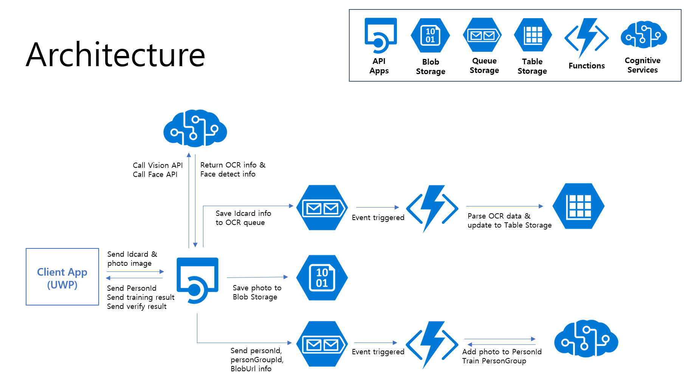
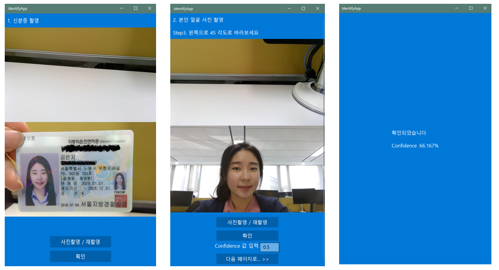

KB is one of the largest bank in Korea. Banking industry is conservative to adopt new technologies  such as cloud services. They are considering the adoption of cloud, starting with Microsoft's AI technology. In this project, we tried to use Microsoft's AI services to examine non-facing authentication scenarios. 

## Key Technologies ## 

- [Microsoft Cognitive Services](https://azure.microsoft.com/en-us/services/cognitive-services/) (Face, Vision)
- [Azure Functions](https://azure.microsoft.com/en-us/services/functions/)
- [Azure API Apps](https://azure.microsoft.com/en-us/services/app-service/api/)
- [Azure Storage](https://azure.microsoft.com/en-us/services/storage/?v=16.50) (Blob, Queue)
- [Universal Windows Platform](https://docs.microsoft.com/en-us/windows/uwp/get-started/universal-application-platform-guide) (Windows 10 App) 

## Core Project Team ##
* Microsoft
	* [Eunji Kim](https://github.com/angie4u) (Microsoft Software Engineer)
	* Hyewon Ryu (Microsoft Program Manager)
	* Seok jin Han(GBB AA/AI TSP)
	* Seungmin Cho(STU TSP)
* KB Bank
	* Sung ho Hong - Smart platform Team
	* Mi sun Yoo - Smart platform Team
	* Sung hak Kim - Smart platform Team
 
## Customer Profile ##

As a core affiliate of KB Financial Group Inc.(KB FG), KB Kookmin Bank is one of the four largest banks ranked by asset value in South Korea since its establishment in 1963. KB FG is a comprehensive financial group that has assets of 299 trillion KRW and also has the largest domestic customer base  based on the widest network, and many branches in Korea. Not only does KB FG have domestic affiliates but also owns worldwide affiliates : KB Asset Management, KB Real Estate Trust, KB Investment, KB Futures, KB Credit Information, KB Date Systems, Kookmin Bank Hong Kong Ltd. (UK), Kookmin Bank International Ltd.(UK), and KB Investment & Securities Hong Kong Ltd.(HK)

## Problem Statement ##

Online banking service was finot the new area and it already has been serviced to many customers at bank branches. In 2017, the first “Internet Bank” was introduced with no on-site bank branches but only services through online. It was spotlighted by many people due to its convenience. High attentions has brought its rapid growth of value of internet banks but at the same time proportionally it became more struggle to build more competitive services. 

One of their ideas was a non face-to-face service that allowed customers could do their businesses without going to a bank. The most important issue for this service was User Authentication. KB Bank hoped to build the service that could verify a user by comparing the photo on  user’s ID card by our AI technology.
 
## Solutions, Steps, and Delivery ##

### Project Target

The primary purpose of this project was to determine if non-face-to-face authentication was possible using Microsoft AI technology. Only their ID card, they can prove themselves to the service. Even thought sometimes this service can not verify the user all the time if the photo taken a log time ago or quality of the photo is not good enough, it can reduce a bunch of work for user and also for the employees who works at the bank. In addition, using Microsoft Vision API - OCR API KB Bank parse the information of the ID card in regardless of which type of ID card it is.   

### Architecture


This service was consists of three parts: Client app(UWP), Azure API apps and Azure functions.
* Client app : Takes pictures and sends it to a server to process
* Azure API Apps : Calls a cognitive services when it receives a request from an application and stores the information to Azure Storage
* Azure functions : Triggers and executes when an event occurs to the queue. Process OCR data, add a photo of that person and train person group.  


### Demo Video 

[](https://1drv.ms/v/s!AsVbhtDr37iriA2GX8HCMukdqXMb)

### Technical details of how this was implemented

**STEP1. Get ID card photo** 

Using the application, user can take ID card photo and send it to the server which is processing the photo. 
Server saves the ID card photo to temp storage and process the photo using FACE API and OCR API. Using FACE API, it can get FACE ID which will be used to verify user. Also using OCR API, it can get information from the image and store it to the Azure Queue Storage.  

[IdentifyWeb - Controllers/IdcardController.cs]	
```
#region Step3. 저장한 blob 위치를 인지서비스에 전달하여 OCR 및 Face 정보 추출
try
{
	foreach (UrlBlob urlBlob in listUrlBlob)
	{
		//OCR 호출
		List<string> contentsOcr = await CognitiveServicesCallHelper.CognitiveServicePostAsync(
			CloudConfigurationManager.GetSetting("CognitiveServicesKeyVision"),
			"https://eastasia.api.cognitive.microsoft.com/vision/v1.0/ocr?language=ko&detectOrientation=true",
			urlBlob.url);

		//OCR 결과를 건별로 Queue에 넣음, trace 표시
		foreach (string content in contentsOcr)
		{
			CloudQueueMessage message = new CloudQueueMessage(content);
			queue.AddMessage(message);

			Trace.WriteLine("OCR: " + content);
		}

		//Face Detection 호출
		List<string> contentsFace = await CognitiveServicesCallHelper.CognitiveServicePostAsync(
			CloudConfigurationManager.GetSetting("CognitiveServicesKeyFace"),
			"https://eastasia.api.cognitive.microsoft.com/face/v1.0/detect?returnFaceAttributes=age,gender,headPose,glasses,accessories",
			urlBlob.url);

		//Face 결과를 trace 표시
		foreach (string content in contentsFace)
		{
			List<FaceDetectResult> faceDetectResults = JsonConvert.DeserializeObject<List<FaceDetectResult>>(content);

			if (faceDetectResults.Count > 0)
			{
				Trace.WriteLine("Face: " + content);
				Trace.WriteLine("FaceId: " + faceDetectResults[0].faceId);

				HttpResponseMessage message = Request.CreateResponse(HttpStatusCode.OK, new JsonFaceId(faceDetectResults[0].faceId));

				return message;
			}
		}
	}
	// return empty FaceId if no faces were found.
	return Request.CreateResponse(HttpStatusCode.OK, new JsonFaceId(""));
}
catch (Exception e)
{
	return Request.CreateErrorResponse(HttpStatusCode.InternalServerError, e);
}
#endregion
```

**STEP 2. GET Photo from user**

Using the application, user can take their photo several times and send it to the server which is processing the photo. 
In this stage, we make a personal ID for user to save several photos from user and use it later when we verify whether the person is the same person in Id card or not.
To implement this, server make PersonalID and save photos to Blob url and send those information to Azure Queue Storage. It will be processed by Azure Functions.

[IdnetifyWeb - Controllers/PersonGroupsController]
```
[Route("api/persongroups/{personGroupId}/persons")]
[HttpPost]
public async Task<HttpResponseMessage> CreatePersonPostAsync(string personGroupId)
{
	var client = new RestClient($"https://eastasia.api.cognitive.microsoft.com/face/v1.0/persongroups/{personGroupId}/persons");
	var request = new RestRequest(Method.POST);
	request.AddHeader("ocp-apim-subscription-key", CloudConfigurationManager.GetSetting("CognitiveServicesKeyFace"));
	request.AddHeader("content-type", "application/json");

	//GUID 생성 코드 추가
	Guid guid = Guid.NewGuid();

	request.AddParameter("application/json", "{\"name\":\"" + guid + "\",\"userData\":\"User-provided data attached to the person\"}", ParameterType.RequestBody);
	IRestResponse response = client.Execute(request);

	CreatePersonResult createPersonResult = JsonConvert.DeserializeObject<CreatePersonResult>(response.Content);

	return Request.CreateResponse(HttpStatusCode.OK, createPersonResult);
}
```

[IdcardWeb - Controllers/PhotoController.cs]
```
#region Step1-Step2. 첨부된 파일을 Web App의 Map Path에 복사하고, 이를 Blob Container에 업로드
MultipartFormdataStreamBlobUploader multipartFormdataStreamBlobUploader = new MultipartFormdataStreamBlobUploader(provider, storageAccount, container);
listUrlBlob = await multipartFormdataStreamBlobUploader.UploadAttachedFileToBlobContainer(this.Request, blobPrefixString);
#endregion

// 변수 만들기 PhotoUploadedResult
// try 안에서 할당
// 스텝4에서 활용
PhotoUploadedResult photoUploadedResult;
HttpResponseMessage message;

#region Step3. 저장한 blob 위치를 json body로 반환
try
{	
	if (listUrlBlob.Count > 0)
	{
		photoUploadedResult = new PhotoUploadedResult(personGroupId, personId, listUrlBlob[0].url); 
		message = Request.CreateResponse(HttpStatusCode.OK, photoUploadedResult);
	}
	else
	{
		photoUploadedResult = new PhotoUploadedResult(personGroupId, personId,"");
		message = Request.CreateResponse(HttpStatusCode.OK, photoUploadedResult);
	}
}
catch (Exception e)
{
	Trace.WriteLine("Exception occurred while reading returningBlobUrl.");
	return Request.CreateErrorResponse(HttpStatusCode.InternalServerError, e);
}
#endregion

#region Step4. Queue에도 전송
try { 	
	CloudQueueMessage messageQueue = new CloudQueueMessage(JsonConvert.SerializeObject(photoUploadedResult));
	queue.AddMessage(messageQueue);

	Trace.WriteLine("BlobInQueue: " + JsonConvert.SerializeObject(photoUploadedResult));
}
catch(Exception e)	{
	Trace.WriteLine("Exception occurred while sending message to queue.");
	return Request.CreateErrorResponse(HttpStatusCode.InternalServerError, e);
}

return message;

#endregion
```

**STEP3. Add photos to PersonalID and train PersonalID** 

When server send message to Azure Queue Storage named photo with the information of PersonalID and image url, Azure function triggered by input and processes images with the PersonalID. 

[kbdwrfunctions - ProcessPhotoQueue.cs]
```
[FunctionName("ProcessPhotoQueue")]
public static void Run([QueueTrigger("photo", Connection = "StorageConnection")]string myQueueItem, TraceWriter log)
{
	log.Info($"C# Queue trigger function processed: {myQueueItem}");
	var jsonData = myQueueItem;

	Photo photo = new Photo();
	photo = JsonConvert.DeserializeObject<Photo>(jsonData);

	// Add Face 
	var photoResult = AddPhoto(photo);
	log.Info(photoResult);

	// Training PersonGroup
	var trainResult = TrainPersonGroup(photo);
	log.Info(trainResult);
}

private static string AddPhoto(Photo photo)
{
	string baseUrl = "https://eastasia.api.cognitive.microsoft.com/face/v1.0/";
	string addPhotoUrl = baseUrl + "persongroups/" + photo.personGroupId + "/persons/" + photo.personId + "/persistedFaces";

	using (var client = new HttpClient())
	{
		client.DefaultRequestHeaders.Add("Ocp-Apim-Subscription-Key", "<FACE API KEY>");

		string httpBody = "{\"url\":\"" +
			photo.blobUrl + "\"}";
		var httpContent = new StringContent(httpBody, Encoding.UTF8, "application/json");

		var response = client.PostAsync(addPhotoUrl, httpContent).Result;

		if (!response.IsSuccessStatusCode)
		{
			return "Http Request was successful.";
		}

		response.EnsureSuccessStatusCode();
		client.Dispose();

		return response.Content.ReadAsStringAsync().Result;
	}
}

	private static string TrainPersonGroup(Photo photo)
{
	string baseUrl = "https://eastasia.api.cognitive.microsoft.com/face/v1.0/";
	string trainGroupUrl = baseUrl + "persongroups/" + photo.personGroupId + "/train";

	using (var client = new HttpClient())
	{
		client.DefaultRequestHeaders.Add("Ocp-Apim-Subscription-Key", "<FACE API KEY>");

		var response = client.PostAsync(trainGroupUrl, null).Result;

		if (!response.IsSuccessStatusCode)
		{
			return "Http Request was successful.";
		}

		response.EnsureSuccessStatusCode();
		client.Dispose();

		return response.Content.ReadAsStringAsync().Result;
	}
}
```

**STEP4. Verify person with ID card and photo**

Server verify the user using FACE API with FACE ID and Person ID

[IdentifyWeb - Controllers/VerifyController.cs]
```
//PostUploadPhotoAndAddQueue
[Route("api/verify/{personGroupId}/{personId}/{faceId}")]
[HttpPost]
public async Task<HttpResponseMessage> VerifyPostAsync(string personGroupId, string personId, string faceId)
{
	InitEnvironment();

	#region 저장한 verify결과를 json body로 반환
	try
	{

		//Verify 호출
		IRestResponse response = await FaceVerifyHelper.FaceVerifyPostAsync(
			CloudConfigurationManager.GetSetting("CognitiveServicesKeyFace"),
			faceId, personId, personGroupId);

		if (response.ResponseStatus == ResponseStatus.Completed && response.StatusCode == HttpStatusCode.OK)
		{
			FaceVerifyResponseBody faceVerifyResponseBody = JsonConvert.DeserializeObject<FaceVerifyResponseBody>(response.Content);

			return Request.CreateResponse(HttpStatusCode.OK, faceVerifyResponseBody);
		}
		else
		{
			return Request.CreateResponse(response.StatusCode, response.Content);
		}
		
	}
	catch (Exception e)
	{
		Trace.WriteLine("Exception occurred while verifying face.");
		return Request.CreateErrorResponse(HttpStatusCode.InternalServerError, e);
	}
	#endregion
}
```
### Scenario


* Take an ID photo and then take several pictures of yourself to verify.
* In this case, recognizing that two persons are the same person with a probability of 66.167%.
* If the camera quality is poor, or the ID photo is old, the recognition rate could be low.
* There is a possibility that it can be used as an additional authentication method.
 
## General lessons ##
* There were many legal restrictions on the use of Public Cloud in the Korean finance industry recently. If it has been included personal information, it will be impossible to handle the data in the Public Cloud. The problem also became a big obstacle in this case. In the case of a project related to personal information from financial industry, it is necessary to discuss deeply about the legal issues.
* Tried to refine the OCR results through the post-processing but we were only able to put the raw OCR results into the table storage due to time constraint.
* Had problem that anyone could request service to server as a unauthorized user could call and use the API. To solve this problem, it was necessary to implement AD or Azure AD to the service. 

## Conclusion ##

With the power of Microsoft AI Service, they can figure out the possibility of face authentication service or even other services using Microsoft Cognitive Services. Also traditionally bank is one of the most conservative business area to adopt new technoloy such as cloud service. During Hackfest, customer impressed by the convience of use cloud service like how quick to deploy their own server, or easy to implement and set up the development environmnet as well. For Microsoft team, we could make customer scenario for bank especailly for authentication and it was also good chance for Microsoft teams to learn from customer and co-work with people who are in charge of other role like GBB or TSP.    
* Have been discussing with KB Bank to adopt of this case for real business.
* Seen the chance to use this scenario as a toehold for Azure adoption of financial industry.

## Resources ##
* Explore [identify-service github repo](https://github.com/kb-project/identify-service)
* [FACE API testing console](https://westus.dev.cognitive.microsoft.com/docs/services/563879b61984550e40cbbe8d/operations/563879b61984550f30395236)
* [ASP.NET Web API: File Upload](https://docs.microsoft.com/en-us/aspnet/web-api/overview/advanced/sending-html-form-data-part-2)
* [Customer Case Story - Uber](https://customers.microsoft.com/en-US/story/uber)

