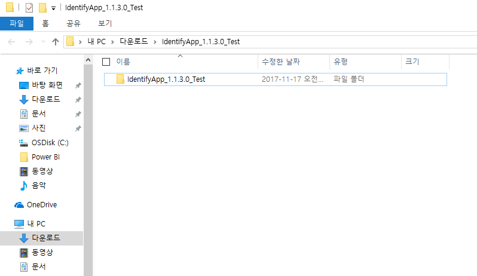
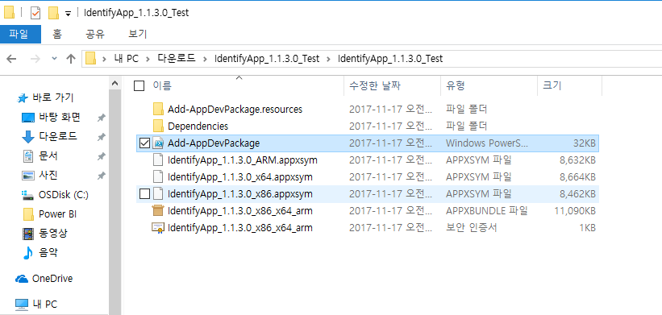
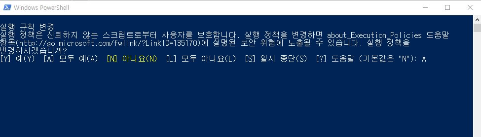
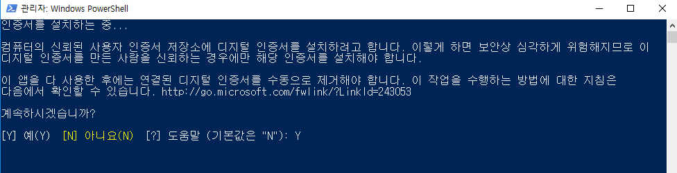
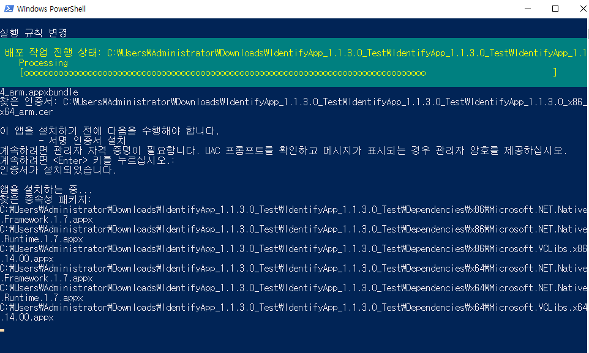

# Windows 10 컴퓨터에서 IdentifyApp 설치방법

별도의 도구를 설치하지 않고 IdentifyApp을 설치하는 방법을 안내해드립니다. 
0. 컴퓨터에 **개발자 기능 사용**이 설정되어 있는지 확인한다.

1. **IdentifyApp_1.1.3.0_Test**파일의 압축을 푼다. 

2. **IdentifyApp_1.1.3.0_Test** 폴더를 열어서 **Add-AppDevPackage**란 이름의 .ps 파일이 있는지 확인한다.

3. 해당 파일을 선택한 후 마우스 우클릭을 하여 목록 중 **PowerShell에서 실행**을 클릭한다. 

4. 파워쉘 스크립트를 실행할 때 다음과 같은 경고 메세지가 나오면 **A**를 입력하여 계속 진행한다. 

5. 인증서 설치관련 부분도 **Y**를 입력하여 계속 진행한다. 

6. 모두 완료하면 다음과 같이 Windows 10 애플리케이션이 컴퓨터에 설치된다. 

7. 윈도우 검색 버튼에서 **IdentifyApp**이라고 검색하면 설치된 애플리케이션을 실행할 수 있다. 

